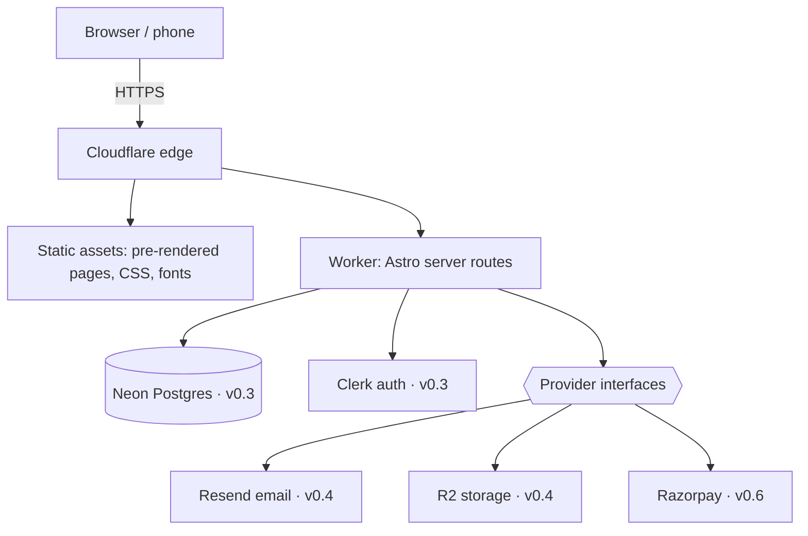
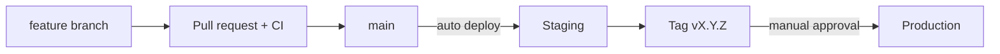

# prep{nest}

[](https://github.com/vasanthpai/PrepNest/actions/workflows/ci.yml)

**Learn it. Quiz it. Ship it.** A tech learning platform: free tech articles, hands-on quizzes
and timed assessments, and practical courses for developers and students.

> 🚧 **Portfolio project, built in public.** Every step has a ticket, a reviewed commit and a
> written log. The goal is a production-grade workflow on a free-tier budget.

## Status

| Version  | Scope                                                    | Status         |
| -------- | -------------------------------------------------------- | -------------- |
| **v0.1** | Foundation, design system, CI/CD, staging and production | 🚧 In progress |
| v0.2     | Blog: articles, topics, SEO, search                      | Planned        |
| v0.3     | Database (Neon + Drizzle) and sign-in (Clerk)            | Planned        |
| v0.4     | Newsletter and free downloads (Resend, R2)               | Planned        |
| v0.5     | Quizzes and timed assessments                            | Planned        |
| v0.6     | Payments (Razorpay, test mode)                           | Planned        |
| v0.7     | Courses                                                  | Planned        |
| v1.0     | Portfolio launch: monitoring, security review, drills    | Planned        |

Details: [roadmap](docs/roadmap.md).

## Architecture



- **Astro** pre-renders content pages at build time; **React islands** only where interaction is
  needed. The home page ships ~0.5 KB of JavaScript.
- One **Cloudflare Worker** per environment (`local`, `staging`, `production`).
- Outside services sit behind **interfaces with fakes**, so business logic is tested without
  network or keys.

More: [architecture](docs/architecture.md) · [decision records](docs/decisions/README.md)

## Delivery pipeline



Feature flags separate **deploying** code from **releasing** features. Rollback is a flag flip or
a redeploy of the previous tag. Full process: [release process](docs/release-process.md).

## Tech stack

| Area      | Choice                                                                    |
| --------- | ------------------------------------------------------------------------- |
| Framework | Astro 7, TypeScript (strictest), React 19 islands                         |
| Styling   | Tailwind CSS 4, "Syntax" design system, self-hosted variable fonts        |
| Hosting   | Cloudflare Workers (`@astrojs/cloudflare`, Wrangler)                      |
| Data      | Neon Postgres + Drizzle ORM (v0.3)                                        |
| Services  | Clerk (auth), Resend (email), Cloudflare R2 (files), Razorpay (test mode) |
| Quality   | Vitest, Playwright (v0.2), ESLint, Prettier, `astro check`                |
| Delivery  | GitHub Actions, Dependabot, GitHub Environments with approval             |

## Quick start

```bash
git clone https://github.com/vasanthpai/PrepNest.git
cd PrepNest
npm install
cp .dev.vars.example .dev.vars
npm run dev          # http://localhost:4321
```

Requires Node.js 24. Full guide and troubleshooting: [setup](docs/setup.md).

| Command             | What it does                                   |
| ------------------- | ---------------------------------------------- |
| `npm run dev`       | Dev server on Cloudflare's runtime (`workerd`) |
| `npm test`          | Unit tests (Vitest)                            |
| `npm run lint`      | ESLint (bugs, React hooks, accessibility)      |
| `npm run typecheck` | TypeScript checks for `.ts`, `.tsx`, `.astro`  |
| `npm run build`     | Production build                               |

## Documentation

| Doc                                          | What's inside                                       |
| -------------------------------------------- | --------------------------------------------------- |
| [Setup](docs/setup.md)                       | Run locally, all scripts, troubleshooting           |
| [Architecture](docs/architecture.md)         | How it fits together, folders, feature flags, rules |
| [Decision records](docs/decisions/README.md) | Why each major choice was made                      |
| [CI/CD](docs/ci-cd.md)                       | Workflows, what each check does, reading failures   |
| [GitHub setup](docs/github-setup.md)         | Branch protection, security scanning, templates     |
| [Release process](docs/release-process.md)   | Branches, PRs, staging, tags, rollback, hotfixes    |
| [Environments](docs/environments.md)         | Local / staging / production, every variable        |
| [Design system](docs/design-system.md)       | Colours, fonts, components, light/dark mode         |
| [Providers](docs/providers.md)               | Email, payment and storage interfaces and fakes     |
| [Testing](docs/testing.md)                   | Test strategy and conventions                       |
| [Roadmap](docs/roadmap.md)                   | Versions v0.1 → v1.0 with status                    |
| [Step logs](docs/steps/README.md)            | What changed in every build step, and why           |
| [Contributing](CONTRIBUTING.md)              | Branches, commit format, PR checklist               |
