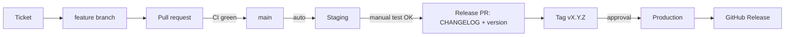

# Release process

How a change travels from an idea to production, and how to undo it.
Why it works this way: [ADR 0009](decisions/0009-branching-and-releases.md).



## 1. Plan

- Each version (v0.2, v0.3, …) is a GitHub **milestone**.
- Each step is a GitHub **issue** with goal, tasks and acceptance criteria, labelled
  `type: feature | chore | test | ci | docs | bug`.

## 2. Develop

```bash
git switch main && git pull
git switch -c feature/v0.2-blog
```

- Commit with [Conventional Commits](https://www.conventionalcommits.org/): `feat:`, `fix:`,
  `chore:`, `docs:`, `test:`, `ci:`, `refactor:`. Breaking changes: `feat!:`.
- Reference the ticket in the commit body: `Closes #12`. The issue closes when the commit reaches `main`.
- New features start **behind a feature flag** (off in staging and production).
- Before pushing: `npm run check` (the same checks CI runs).

## 3. Pull request

- Title in Conventional Commits form (checked by CI from step 12): `feat: add blog post pages`.
- CI must pass: lint, format, type check, unit tests, build (later: e2e tests).
- Merge with **Rebase and merge**, so `main` stays linear and every conventional commit is kept
  (the changelog is built from them).

## 4. Staging (automatic)

Every push to `main` runs `deploy-staging.yml`:

1. Build with `CLOUDFLARE_ENV=staging`
2. Run database migrations on the **staging** database (from v0.3)
3. Deploy the `prepnest-staging` Worker
4. Smoke test: `GET /api/health` must return `{"status":"ok","env":"staging"}`

Then test the version's checklist manually on the staging URL. Turn the new feature's flag on for
`staging` if it isn't yet.

## 5. Release to production

1. **Release PR** from a branch `release/vX.Y.Z`:
   - Move the `Unreleased` notes in `CHANGELOG.md` under `## [X.Y.Z] - YYYY-MM-DD`
   - `npm version X.Y.Z --no-git-tag-version` (updates `package.json` and the lockfile)
   - Turn feature flags on for `production` if this release ships them
   - Commit: `chore(release): vX.Y.Z`
2. Merge it (CI green; staging redeploys with the final code).
3. **Tag** the merge commit on `main`:
   ```bash
   git switch main && git pull
   git tag -a vX.Y.Z -m "vX.Y.Z"
   git push origin vX.Y.Z
   ```
4. `deploy-production.yml` starts and **waits for approval** (GitHub → Actions → the run →
   **Review deployments** → `production` → **Approve and deploy**).
5. After approval: migrations on the **production** database → deploy `prepnest-production` →
   smoke test → **GitHub Release** created with the CHANGELOG notes.

### Versioning (SemVer)

| Change                               | Before 1.0      | After 1.0      |
| ------------------------------------ | --------------- | -------------- |
| A planned version (v0.2 blog, …)     | `0.Y.0` (minor) | minor or major |
| A fix to a released version          | `0.Y.Z` (patch) | patch          |
| Breaking change for users or the API | minor           | major          |

### CHANGELOG

`CHANGELOG.md` follows [Keep a Changelog](https://keepachangelog.com/): sections **Added**,
**Changed**, **Fixed**, **Removed**, **Security**, written for people, not copied from commits.
From v0.3, release-please drafts it from commit messages.

## 6. Rollback

Use the lightest option that fixes the problem:

| Situation                   | Action                                                                   | Time    |
| --------------------------- | ------------------------------------------------------------------------ | ------- |
| A new feature misbehaves    | Set its flag to `false` for production → PR → release a patch            | ~10 min |
| The whole release is broken | Re-run `deploy-production.yml` for the **previous tag** (manual run)     | ~5 min  |
| Emergency, CI unavailable   | `npx wrangler rollback --env production` (Cloudflare's previous version) | ~1 min  |

**Never roll back a database migration in production.** Migrations are written so the previous
release still works against the new schema (see below), so code can roll back on its own.

## 7. Hotfix

```bash
git switch main && git pull
git switch -c fix/quiz-timer-negative
# fix + test, commit "fix: stop quiz timer below zero" with "Closes #NN"
```

PR → merge → staging check → release PR for the patch version (`vX.Y.Z+1`) → tag → approve.

## 8. Safe database migrations (expand, then contract)

From v0.3 every schema change must keep the **previous release** working:

| Goal            | Release N (expand)                          | Release N+1 (contract)                 |
| --------------- | ------------------------------------------- | -------------------------------------- |
| Add a column    | Add it as nullable or with a default        | Make it required, if needed            |
| Rename a column | Add the new column, write to both, backfill | Stop reading the old one, then drop it |
| Remove a column | Stop using it in code                       | Drop it                                |

Migrations run on staging first (every merge), then production (every tag).

## Checklists

**Before tagging**

- [ ] Staging smoke test passed and the version's manual checklist is done on staging
- [ ] `CHANGELOG.md` and `package.json` version updated in the release PR
- [ ] Feature flags for this release set for production
- [ ] Migrations are backward-compatible

**After deploying**

- [ ] `GET /api/health` on production shows the new `version`
- [ ] Key pages load on a phone
- [ ] GitHub Release published; milestone closed
